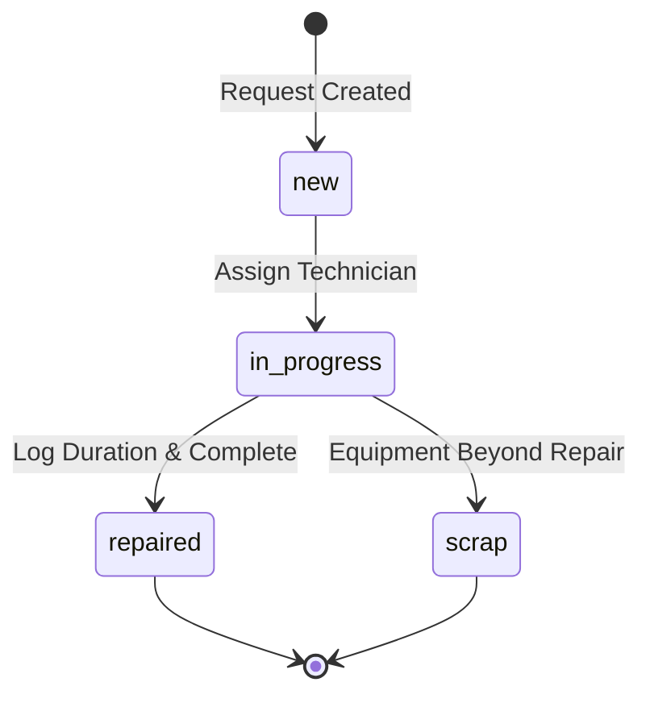
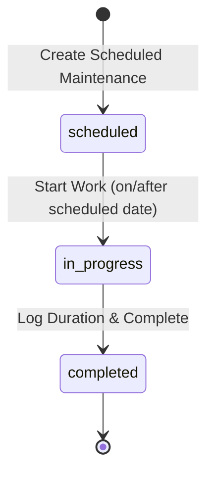
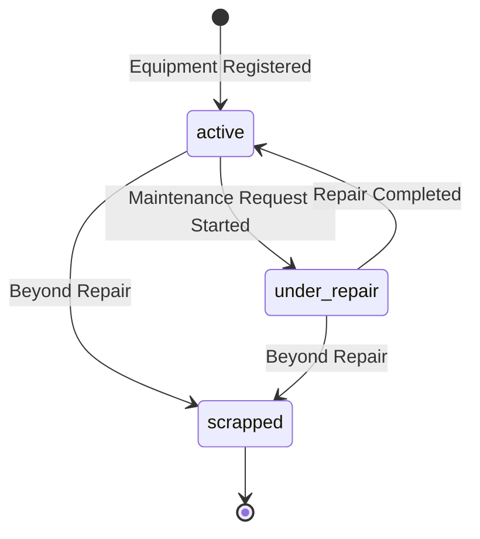

# Workflows Document

## Overview

This document defines all business workflows, state machines, and process flows in the GearGuard system.

## Workflow State Machines

### 1. Corrective Maintenance Request Workflow

#### States

| State | Description | Can Transition To | Entry Conditions |
|-------|-------------|-------------------|------------------|
| **new** | Request created, awaiting assignment | in_progress | Request created |
| **in_progress** | Technician working on repair | repaired, scrap | Technician assigned |
| **repaired** | Repair completed successfully | (none) | Duration logged |
| **scrap** | Equipment beyond repair | (none) | Equipment unusable |

#### State Transition Diagram



#### Transition Rules

```typescript
// State transition validation
const correctiveTransitions = {
  new: {
    canTransitionTo: ['in_progress'],
    requiredFields: ['subject', 'equipmentId', 'priority'],
    validations: ['equipment must be active']
  },
  
  in_progress: {
    canTransitionTo: ['repaired', 'scrap'],
    requiredFields: ['technician'],
    validations: ['technician must be from assigned team']
  },
  
  repaired: {
    canTransitionTo: [],
    requiredFields: ['duration', 'completionNotes'],
    validations: ['duration > 0'],
    sideEffects: ['set equipment status to active', 'set completedAt timestamp']
  },
  
  scrap: {
    canTransitionTo: [],
    requiredFields: ['scrapReason', 'duration'],
    validations: ['requires manager approval'],
    sideEffects: ['set equipment status to scrapped', 'show warning banner']
  }
};
```

### 2. Preventive Maintenance Request Workflow

#### States

| State | Description | Can Transition To | Entry Conditions |
|-------|-------------|-------------------|------------------|
| **scheduled** | Maintenance planned for future date | in_progress | Scheduled date set |
| **in_progress** | Technician performing maintenance | completed | On/after scheduled date |
| **completed** | Maintenance finished | (none) | Duration logged |

#### State Transition Diagram



#### Transition Rules

```typescript
// Preventive maintenance transitions
const preventiveTransitions = {
  scheduled: {
    canTransitionTo: ['in_progress'],
    requiredFields: ['subject', 'equipmentId', 'scheduledDate'],
    validations: ['scheduledDate >= today']
  },
  
  in_progress: {
    canTransitionTo: ['completed'],
    requiredFields: ['technician'],
    validations: ['currentDate >= scheduledDate']
  },
  
  completed: {
    canTransitionTo: [],
    requiredFields: ['duration', 'completionNotes'],
    validations: ['duration > 0'],
    sideEffects: ['set completedAt timestamp', 'update lastMaintenanceDate on equipment']
  }
};
```

### 3. Equipment Status Workflow

#### States

| State | Description | Triggered By | Can Transition To |
|-------|-------------|--------------|-------------------|
| **active** | Operational equipment | Default state | under_repair, scrapped |
| **under_repair** | Equipment being serviced | Request moves to in_progress | active, scrapped |
| **scrapped** | Permanently decommissioned | Request moves to scrap | (none) |

#### State Transition Diagram



#### Transition Rules

```typescript
// Equipment status transitions
const equipmentStatusTransitions = {
  active: {
    canTransitionTo: ['under_repair', 'scrapped'],
    triggers: {
      under_repair: 'Any maintenance request moves to in_progress',
      scrapped: 'Any maintenance request moves to scrap'
    }
  },
  
  under_repair: {
    canTransitionTo: ['active', 'scrapped'],
    triggers: {
      active: 'All in_progress requests completed',
      scrapped: 'Any maintenance request moves to scrap'
    }
  },
  
  scrapped: {
    canTransitionTo: [],
    sideEffects: [
      'Close all open maintenance requests',
      'Display warning banner on equipment form',
      'Prevent new maintenance request creation'
    ]
  }
};
```

## Business Process Flows

### Process 1: Report Equipment Breakdown

**Actors**: Equipment Owner, System

**Flow**:

```
1. User navigates to Kanban Board
2. User clicks "New Request" button
3. System displays request creation modal
4. User fills form:
   - Subject: "CNC Machine Not Starting"
   - Type: Corrective (default)
   - Equipment: Select from dropdown
   - Priority: High
   - Description: Detailed issue description
5. System auto-fills:
   - Category (from equipment)
   - Maintenance Team (from equipment)
6. User clicks "Submit"
7. System validates:
   - All required fields present
   - Equipment is not scrapped
8. System creates request with stage = "new"
9. System displays request card in "New" column
10. System increments equipment.openRequestsCount
```

**Validation Rules**:
- Subject: Required, 1-255 characters
- Equipment: Required, must exist, must not be scrapped
- Priority: Required for corrective requests
- Type: Cannot be changed after creation

**Error Scenarios**:
- Equipment is scrapped → Show error "Cannot create request for scrapped equipment"
- Missing required fields → Highlight fields in red, show error message
- Network error → Show retry button

### Process 2: Assign and Start Repair

**Actors**: Maintenance Manager, Technician, System

**Flow**:

```
1. Manager views Kanban Board
2. Manager clicks request card in "New" column
3. System displays request details modal
4. Manager selects technician from team
5. Manager clicks "Assign"
6. System updates request.technician
7. Technician drags card from "New" to "In Progress"
8. System validates:
   - Technician is assigned
   - Equipment is available (not scrapped)
9. System updates request.stage = "in_progress"
10. System updates equipment.status = "under_repair"
11. System sends notification to technician (future)
```

**Business Rules**:
- Only team members can be assigned
- Multiple requests can be in progress simultaneously
- Equipment status changes when first request starts

### Process 3: Complete Repair

**Actors**: Technician, System

**Flow**:

```
1. Technician finishes repair work
2. Technician drags card from "In Progress" to "Repaired"
3. System displays duration entry modal
4. Technician enters:
   - Duration: 2.5 hours
   - Completion Notes: "Replaced faulty motor"
5. System validates:
   - Duration > 0
   - Completion notes present
6. Technician clicks "Complete"
7. System updates:
   - request.stage = "repaired"
   - request.duration = 2.5
   - request.completedAt = current timestamp
   - request.hoursSpent += 2.5
8. System checks other requests for same equipment
9. If no other in_progress requests:
   - System updates equipment.status = "active"
10. System decrements equipment.openRequestsCount
11. System displays success message
```

**Validation Rules**:
- Duration: Required, must be > 0, max 999.9 hours
- Completion notes: Recommended but not required

**Side Effects**:
- Equipment becomes active if no other repairs ongoing
- Completion timestamp recorded
- Hours added to technician's logged time (future)

### Process 4: Scrap Equipment

**Actors**: Maintenance Manager, System

**Flow**:

```
1. Manager realizes equipment is beyond repair
2. Manager drags request from "In Progress" to "Scrap"
3. System displays scrap confirmation dialog:
   "This will mark the equipment as SCRAPPED. This action cannot be undone."
4. Manager enters:
   - Scrap Reason: "Motor seized, repair cost exceeds replacement"
   - Duration: Hours spent before scrapping
5. Manager clicks "Confirm Scrap"
6. System updates:
   - request.stage = "scrap"
   - request.duration = entered value
   - request.completedAt = current timestamp
   - equipment.status = "scrapped"
7. System finds all other open requests for equipment
8. System auto-closes those requests with note "Equipment scrapped"
9. System displays warning banner on equipment detail page:
   "⚠️ This equipment is no longer operational"
10. System prevents new request creation for this equipment
```

**Authorization**:
- Only managers can scrap equipment
- Requires confirmation dialog
- Cannot be undone (business rule)

**Side Effects**:
- Equipment permanently unusable
- All open requests closed
- Equipment removed from active equipment list (filtered)
- Warning banner displayed

### Process 5: Schedule Preventive Maintenance

**Actors**: Maintenance Manager, System

**Flow**:

```
1. Manager navigates to Calendar View
2. Manager clicks future date (e.g., January 15, 2025)
3. System displays create request modal
4. System pre-fills:
   - Type: Preventive
   - Scheduled Date: Clicked date
5. Manager fills:
   - Subject: "Monthly CNC Inspection"
   - Equipment: CNC Machine #1
   - Description: "Check alignment, lubricate moving parts"
6. System auto-fills:
   - Category (from equipment)
   - Maintenance Team (from equipment)
7. Manager clicks "Schedule"
8. System validates:
   - Scheduled date is in future
   - Equipment is not scrapped
9. System creates request with stage = "scheduled"
10. System displays event on calendar date
11. System increments equipment.openRequestsCount
```

**Validation Rules**:
- Scheduled date: Required, must be >= today
- Subject: Required
- Equipment: Required, must not be scrapped

**Calendar Display**:
- Events shown on scheduled date
- Color-coded by priority or team
- Only preventive requests appear in calendar

### Process 6: Execute Preventive Maintenance

**Actors**: Technician, System

**Flow**:

```
1. Scheduled date arrives
2. System highlights overdue preventive maintenance (if not started)
3. Technician clicks event in calendar
4. System displays request details
5. Technician clicks "Start Maintenance"
6. System validates:
   - Current date >= scheduled date
7. System updates request.stage = "in_progress"
8. Technician performs maintenance
9. Technician clicks "Complete"
10. System displays duration entry modal
11. Technician enters:
    - Duration: 1.5 hours
    - Completion Notes: "All checks passed"
12. System updates:
    - request.stage = "completed"
    - request.duration = 1.5
    - request.completedAt = current timestamp
13. System decrements equipment.openRequestsCount
14. Event remains on calendar but marked as completed
```

**Overdue Logic**:
- Request is overdue if: today > scheduledDate AND stage = "scheduled"
- Overdue requests highlighted in red
- Overdue count shown in dashboard

### Process 7: View Equipment Maintenance History

**Actors**: Any User, System

**Flow**:

```
1. User clicks equipment card in Equipment List
2. System navigates to Equipment Detail page
3. System displays:
   - Equipment details (top section)
   - Smart button "Maintenance: 3" (open requests count)
   - Maintenance History timeline (bottom section)
4. System queries all maintenance requests for this equipment
5. System sorts requests by createdAt (newest first)
6. System displays each request:
   - Subject
   - Type badge
   - Stage badge
   - Created date
   - Completed date (if applicable)
   - Duration (if logged)
7. User clicks smart button
8. System navigates to Request List filtered by equipment
```

**Smart Button Logic**:
```typescript
// Calculate open requests count
const openRequestsCount = requests.filter(r => 
  r.equipmentId === equipment.id && 
  !['repaired', 'completed', 'scrap'].includes(r.stage)
).length;
```

### Process 8: Drag and Drop Stage Change (Kanban)

**Actors**: User, System, react-beautiful-dnd

**Flow**:

```
1. User clicks and holds request card
2. react-beautiful-dnd enters drag mode
3. User drags card over "In Progress" column
4. System highlights drop zone
5. User releases mouse
6. react-beautiful-dnd fires onDragEnd event
7. System receives:
   - draggableId: request ID
   - source: { droppableId: "new" }
   - destination: { droppableId: "in_progress" }
8. System maps droppableId to stage:
   - "new" → RequestStage.NEW
   - "in_progress" → RequestStage.IN_PROGRESS
   - "repaired" → RequestStage.REPAIRED
   - "scrap" → RequestStage.SCRAP
9. System validates transition:
   - Check if transition is allowed
   - Check required fields present
10. If valid:
    - System updates request.stage
    - System updates UI optimistically
    - System triggers side effects
11. If invalid:
    - System reverts card position
    - System shows error toast
```

**Validation Examples**:
```typescript
// Cannot move to Repaired without duration
if (newStage === 'repaired' && !request.duration) {
  showError('Duration required before completion');
  return false;
}

// Cannot move from Repaired to Scrap
if (currentStage === 'repaired' && newStage === 'scrap') {
  showError('Cannot scrap already repaired request');
  return false;
}
```

## Automation Workflows

### Auto-fill on Equipment Selection

**Trigger**: User selects equipment in request form

**Actions**:
1. Query equipment details
2. Set category field = equipment.category (read-only)
3. Set maintenanceTeamId = equipment.maintenanceTeamId (read-only)
4. Display team name for confirmation

### Auto-update Equipment Status

**Trigger**: Maintenance request stage changes

**Logic**:
```typescript
// When any request moves to in_progress
if (newStage === 'in_progress') {
  equipment.status = 'under_repair';
}

// When request moves to repaired
if (newStage === 'repaired') {
  // Check if any other requests are in_progress
  const otherActiveRequests = requests.filter(r => 
    r.equipmentId === request.equipmentId && 
    r.id !== request.id && 
    r.stage === 'in_progress'
  );
  
  if (otherActiveRequests.length === 0) {
    equipment.status = 'active';
  }
}

// When request moves to scrap
if (newStage === 'scrap') {
  equipment.status = 'scrapped';
  
  // Close all other open requests
  const openRequests = requests.filter(r => 
    r.equipmentId === request.equipmentId && 
    r.id !== request.id &&
    !['repaired', 'completed', 'scrap'].includes(r.stage)
  );
  
  openRequests.forEach(r => {
    r.stage = 'scrap';
    r.notes = 'Auto-closed: Equipment scrapped';
  });
}
```

### Overdue Calculation

**Trigger**: Real-time, on page load, on data change

**Logic**:
```typescript
const isOverdue = (request: MaintenanceRequest): boolean => {
  // Not overdue if already completed
  if (['repaired', 'completed', 'scrap'].includes(request.stage)) {
    return false;
  }
  
  // Only scheduled requests can be overdue
  if (!request.scheduledDate) {
    return false;
  }
  
  // Compare dates
  const today = new Date();
  const scheduled = new Date(request.scheduledDate);
  
  return scheduled < today;
};
```

### Open Requests Count

**Trigger**: Request created, stage changed, request deleted

**Logic**:
```typescript
const updateOpenRequestsCount = (equipmentId: string) => {
  const count = requests.filter(r => 
    r.equipmentId === equipmentId &&
    !['repaired', 'completed', 'scrap'].includes(r.stage)
  ).length;
  
  equipment.openRequestsCount = count;
};
```

## Error Handling Workflows

### Network Error Recovery

```
1. API call fails
2. System catches error
3. System logs error to console
4. System displays user-friendly message:
   "Failed to save changes. Please try again."
5. System provides retry button
6. User clicks retry
7. System re-attempts API call
8. If successful → Update UI
9. If fails again → Escalate to support message
```

### Validation Error Display

```
1. User submits form
2. System validates all fields
3. System collects all errors
4. System displays errors:
   - Highlight invalid fields in red border
   - Show error message below field
   - Scroll to first error
   - Focus first invalid field
5. User corrects errors
6. System re-validates on blur
7. System removes error when field becomes valid
```

### Concurrent Edit Conflict

```
1. User A opens request details
2. User B opens same request
3. User B updates and saves
4. User A updates and tries to save
5. System detects version mismatch
6. System shows conflict dialog:
   "This request was updated by another user."
   - Show changes
   - Options: Reload, Force Save
7. User chooses action
8. System resolves conflict
```

---

**Document Maintained By**: Product & Engineering Teams  
**Last Updated**: December 2024  
**Version**: 1.0
